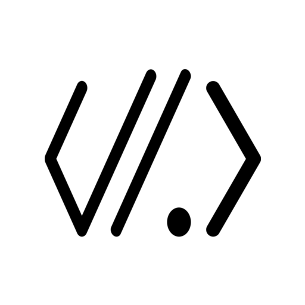
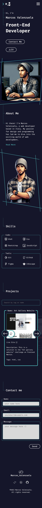

<a name="readme-top"></a>

[![Contributors][contributors-shield]][contributors-url]
[![Forks][forks-shield]][forks-url]
[![Stargazers][stars-shield]][stars-url]
[![Issues][issues-shield]][issues-url]
[![License][license-shield]][license-url]
[![LinkedIn][linkedin-shield]][linkedin-url]

<!-- PROJECT LOGO -->
<br />
<div align="center">
  <a href="https://github.com/Dantalian5/marcosvalenzuela2.0">
    
  </a>

<h3 align="center">Marcos Valenzuela's Portfolio</h3>

  <p align="center">
    This is my personal portfolio
    <br />
    <a href="https://github.com/Dantalian5/marcosvalenzuela2.0"><strong>Explore the docs »</strong></a>
    <br />
    <br />
    <a href="https://marcosvalenzuela.netlify.app">View Live Site</a>
    ·
    <a href="https://github.com/Dantalian5/marcosvalenzuela2.0/issues">Report Bug</a>
    ·
    <a href="https://github.com/Dantalian5/marcosvalenzuela2.0/issues">Request Feature</a>
  </p>
</div>

<!-- TABLE OF CONTENTS -->
<details>
  <summary>Table of Contents</summary>
  <ol>
    <li>
      <a href="#about-the-project">About The Project</a>
      <ul>
        <li><a href="#built-with">Built With</a></li>
      </ul>
    </li>
    <li>
      <a href="#getting-started">Getting Started</a>
      <ul>
        <li><a href="#prerequisites">Prerequisites</a></li>
        <li><a href="#installation">Installation</a></li>
      </ul>
    </li>
    <li><a href="#roadmap">Roadmap</a></li>
    <li><a href="#contributing">Contributing</a></li>
    <li><a href="#license">License</a></li>
    <li><a href="#contact">Contact</a></li>
    <li><a href="#acknowledgments">Acknowledgments</a></li>
  </ol>
</details>

<!-- ABOUT THE PROJECT -->

## About The Project

<div align="center" >
    
    
</div>

This is my personal portfolio, where you can find my current situation, knowledge, progress, skills, and abilities, as well as a showcase of my best works, and, above all, a way to contact me.

<p align="right">(<a href="#readme-top">back to top</a>)</p>

### Built With

- Semantic HTML5 markup
- CSS custom properties
- Flexbox
- Javascript
- Mobile-first workflow
- [ParcelJS (bundler)][parceljs-url]

- Figma
- Github
- Netlify

After creating the design in Figma, I opted for a "vanilla" approach, where the only framework used was SCSS, with the idea of solidifying what I have learned from the ground up, without resorting to faster solutions like Bootstrap, Tailwind, or Astra, purely for educational purposes.
Starting from responsive design to the concepts of "Mobile first" and "Accessible web", building upon the foundation of HTML and CSS, their various frameworks, and their proper usage. Additionally, including the use of Git and GitHub as version control systems and Netlify and GitHub Pages as methods of publishing web pages.

<p align="right">(<a href="#readme-top">back to top</a>)</p>

<!-- GETTING STARTED -->

## Getting Started

### Prerequisites

- node - npm

### Installation

1. Clone the repo
   ```sh
   git clone https://github.com/Dantalian5/marcosvalenzuela2.0.git
   ```
2. Install NPM packages
   ```sh
   npm install
   ```
3. Run the dev mode on parceljs bundler
   ```js
   npm run dev
   ```
4. Run the build mode on parceljs bundler
   ```js
   npm run build
   ```

<p align="right">(<a href="#readme-top">back to top</a>)</p>

<!-- USAGE EXAMPLES -->

## Roadmap

- [x] Design the Portfolio
- [x] Program the Portfolio
  - [x] Html & Css
  - [x] Javascript Basic
  - [ ] Javascript Advanced
- [x] Mount the portfolio on a server

See the [open issues](https://github.com/Dantalian5/marcosvalenzuela2.0/issues) for a full list of proposed features (and known issues).

<p align="right">(<a href="#readme-top">back to top</a>)</p>

<!-- LICENSE -->

## License

Distributed under the MIT License. See `LICENSE.md` for more information.

<p align="right">(<a href="#readme-top">back to top</a>)</p>

<!-- CONTACT -->

## Contact

- Website - [Marcos Valenzuela](https://marcosvalenzuela.netlify.app)
- Frontend Mentor - [@Dantalian5](https://www.frontendmentor.io/profile/Dantalian5)
- Github - [@Dantalian5](https://github.com/Dantalian5)
- Linkedin - [Marcos Valenzuela](https://www.linkedin.com/in/marcos-valenzuela-coding)
- Twitter - [@Dantalian5](https://www.twitter.com/Dantalian5)

Made and designed with love by [me](https://marcosvalenzuela.netlify.app).

<p align="right">(<a href="#readme-top">back to top</a>)</p>

<!-- ACKNOWLEDGMENTS -->

## Acknowledgments

- [start2impact University](https://www.start2impact.it)
- [Frontendmentor.io](https://www.frontendmentor.io/)
- [interneting is hard](https://internetingishard.netlify.app)
- [Conquering Responsive Layouts](https://courses.kevinpowell.co/conquering-responsive-layouts)

<p align="right">(<a href="#readme-top">back to top</a>)</p>

<!-- MARKDOWN LINKS & IMAGES -->
<!-- https://www.markdownguide.org/basic-syntax/#reference-style-links -->

[contributors-shield]: https://img.shields.io/github/contributors/Dantalian5/marcosvalenzuela2.0.svg?style=for-the-badge
[contributors-url]: https://github.com/Dantalian5/marcosvalenzuela2.0/graphs/contributors
[forks-shield]: https://img.shields.io/github/forks/Dantalian5/marcosvalenzuela2.0.svg?style=for-the-badge
[forks-url]: https://github.com/Dantalian5/marcosvalenzuela2.0/network/members
[stars-shield]: https://img.shields.io/github/stars/Dantalian5/marcosvalenzuela2.0.svg?style=for-the-badge
[stars-url]: https://github.com/Dantalian5/marcosvalenzuela2.0/stargazers
[issues-shield]: https://img.shields.io/github/issues/Dantalian5/marcosvalenzuela2.0.svg?style=for-the-badge
[issues-url]: https://github.com/Dantalian5/marcosvalenzuela2.0/issues
[license-shield]: https://img.shields.io/github/license/Dantalian5/marcosvalenzuela2.0.svg?style=for-the-badge
[license-url]: https://github.com/Dantalian5/marcosvalenzuela2.0/blob/main/LICENSE
[linkedin-shield]: https://img.shields.io/badge/-LinkedIn-black.svg?style=for-the-badge&logo=linkedin&colorB=555
[linkedin-url]: https://www.linkedin.com/in/marcos-valenzuela-coding
[desktop-screenshot]: ./screenshot-desktop.jpg
[mobile-screenshot]: ./screenshot-mobile.jpg
