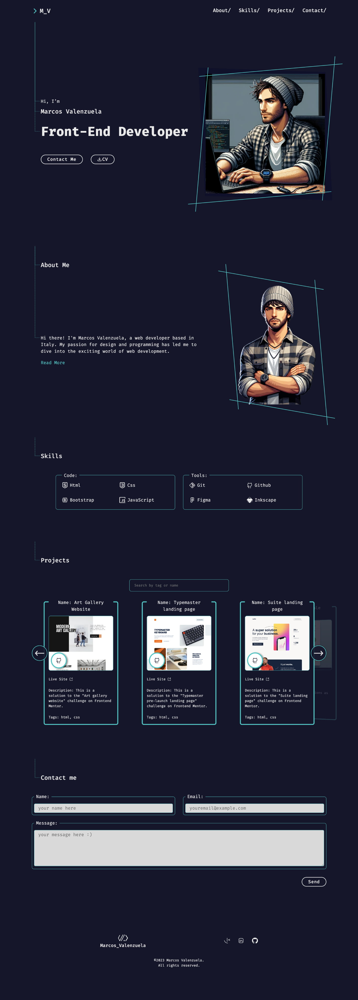

# Marcos Valenzuela | Portfolio

This is the first version of my personal portfolio.

## Table of contents

- [Marcos Valenzuela | Portfolio](#marcos-valenzuela-|-portfolio)
  - [Table of contents](#table-of-contents)
  - [Overview](#overview)
    - [The challenge](#the-challenge)
    - [Screenshot](#screenshot)
    - [Links](#links)
  - [My process](#my-process)
    - [Built with](#built-with)
    - [What I learned](#what-i-learned)
    - [Continued development](#continued-development)
    - [Useful resources](#useful-resources)
  - [Author](#author)
  - [Acknowledgments](#acknowledgments)

## Overview

### The challenge

Create a functional portfolio, using only what I have learned so far (HTML and CSS as a foundation). It must meet the requirements of "mobile first" and "responsive design", be appealing to the user, intuitive in navigation, and mostly "accessible".

### Screenshot

 

### Links

- Solution URL: [Github repo](https://github.com/Dantalian5/marcosvalenzuela.git)
- Live Site URL: [marcosvalenzuela.netlify.app](https://marcosvalenzuela.netlify.app)

## My process

### Built with

- Semantic HTML5 markup
- CSS custom properties
- Sass/Scss
- Mobile-first workflow & Responsive Design

After creating the design in Figma, I opted for a "vanilla" approach, where the only framework used was SCSS, with the idea of solidifying what I have learned from the ground up, without resorting to faster solutions like Bootstrap, Tailwind, or Astra, purely for educational purposes.

### What I learned

- Html
- Css
- Bootstrap
- Tailwind
- Figma
- Git/Github

Starting from responsive design to the concepts of "Mobile first" and "Accessible web", building upon the foundation of HTML and CSS, their various frameworks, and their proper usage. Additionally, including the use of Git and GitHub as version control systems and Netlify and GitHub Pages as methods of publishing web pages.

### Continued development

As a future project, I would like to focus on using JavaScript to enhance this portfolio, improve its accessibility, add a communication form, and if possible, enhance the overall design.

### Useful resources

- [interneting is hard](https://internetingishard.netlify.app)
- [Conquering Responsive Layouts](https://courses.kevinpowell.co/conquering-responsive-layouts)
- [Frontendmentor.io](https://www.frontendmentor.io/)

## Author

- Website - [Marcos Valenzuela](https://marcosvalenzuela.netlify.app)
- Frontend Mentor - [@Dantalian5](https://www.frontendmentor.io/profile/Dantalian5)
- Github - [@Dantalian5](https://github.com/Dantalian5)
- Linkedin - [Marcos Valenzuela](www.linkedin.com/in/marcos-valenzuela-coding)

## Acknowledgments

- [Start2impact University](https://www.start2impact.it) 
- [Frontend Mentor](https://www.frontendmentor.io)
